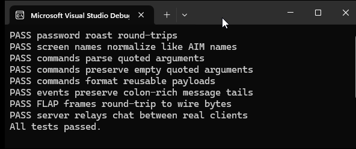

# AOL TOC Chat

A small .NET 10 C# solution that implements a local AOL TOC/TOC2-style chat server plus a reusable client/protocol library.

This is not a connector to the retired AOL/AIM network. It preserves the practical shape of TOC-style clients and servers: `FLAPON` negotiation, FLAP frames, roasted passwords, `toc_` / `toc2_` command names, and colon-delimited server events.



## Projects

- `src/AolToc.Protocol` - FLAP framing, command/event parsing, password roasting, and `TocChatClient`.
- `src/AolToc.Server` - TCP chat server with in-memory login and room state.
- `src/AolToc.Client` - interactive console chat client.
- `tests/AolToc.Tests` - no-NuGet test runner with protocol tests and a real server/client relay smoke test.

## Features

- TOC and TOC2 command aliases: `toc_*` and `toc2_*`.
- FLAP-framed client/server communication over TCP.
- Classic TOC password roasting with `0x` hex payloads.
- In-memory user authentication.
- Optional auto-registration.
- Duplicate login protection.
- Chatroom join, leave, broadcast, and whisper.
- Direct IM delivery between online users.
- Console client with slash commands.

## Run It

From this folder:

```powershell
dotnet build .\AolTocChat.slnx
```

Start the server:

```powershell
dotnet run --project .\src\AolToc.Server -- --port 5190
```

By default the server creates these users:

- `alice` / `password`
- `bob` / `password`
- `carol` / `password`

Start two clients in separate terminals:

```powershell
dotnet run --project .\src\AolToc.Client -- --user alice --password password
dotnet run --project .\src\AolToc.Client -- --user bob --password password --toc2
```

In each client:

```text
/join lobby
hello everyone
```

## Client Commands

```text
/join room        Join or create a chat room
/rooms            List rooms joined by this client
/room room        Set the active room
/leave [room]     Leave a room
/w user message   Whisper in the active room
/im user message  Send a direct IM
/quit             Sign off
```

## Server Options

```powershell
dotnet run --project .\src\AolToc.Server -- --host 127.0.0.1 --port 5190
dotnet run --project .\src\AolToc.Server -- --user alice=password --user bob=password
dotnet run --project .\src\AolToc.Server -- --allow-registration
```

Use `--host any` to bind to `0.0.0.0`.

## Supported Protocol Subset

Client commands:

- `toc_signon` / `toc2_signon`
- `toc_chat_join` / `toc2_chat_join`
- `toc_chat_send` / `toc2_chat_send`
- `toc_chat_whisper` / `toc2_chat_whisper`
- `toc_chat_leave` / `toc2_chat_leave`
- `toc_send_im` / `toc2_send_im`
- `toc_signoff` / `toc2_signoff`
- No-op compatibility commands: `toc_init`, `toc_set_config`, `toc_add_buddy`, `toc_remove_buddy`, plus TOC2 forms.

Server events:

- `SIGN_ON` / `SIGN_ON2`
- `ERROR`
- `CHAT_JOIN` / `CHAT_JOIN2`
- `CHAT_IN` / `CHAT_IN2`
- `CHAT_UPDATE_BUDDY` / `CHAT_UPDATE_BUDDY2`
- `IM_IN` / `IM_IN2`
- `IM_OUT` / `IM_OUT2`

## Tests

```powershell
dotnet run --project .\tests\AolToc.Tests
```

The test runner checks password roasting, command parsing/formatting, FLAP frame encoding, and an end-to-end relay where one TOC client and one TOC2 client join a room and exchange a message through the server.

## Notes for Extending

- Replace `InMemoryUserStore` if you want database-backed users.
- Add stricter command validation in `ClientSession` if you want closer historical TOC behavior.
- Keep room messages as the final event field if you extend server events; messages can contain colons, and the client intentionally joins trailing event fields back together.
